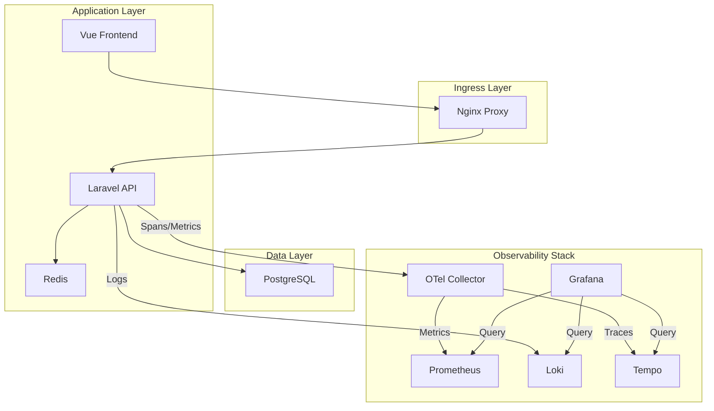

# 🚀 Hackathon 2.0: Production-Grade Observability Ecosystem

[]()
[]()
[]()
[]()

> "It’s not enough for an application to simply work; it must be observable, resilient, and verifiable under pressure."

---

## 🏗 Architectural Deep Dive

This project implements a **Distributed Micro-Observability Pattern**. Every request is tracked, every metric is counted, and Every log is correlated.



---

## 🌟 Key Features

### 1. 🕵️‍♂️ Full-Stack Distributed Tracing (Tempo)

- **Automatic Correlation**: Trace IDs are automatically injected into Laravel logs (Loki) and propagated through downstream services.
- **Trace-to-Log Navigation**: In Grafana, you can move from a slow trace directly to the specific logs that caused the bottleneck.

### 2. 📈 Real-Time Business Metrics

- **Dynamic Sales Reporting**: Custom OTel counters track "Total Sales" and product stock in real-time.
- **Database Performance**: Automatic instrumentation of SQL queries to measure duration (ms) and count, identifying slow queries before they hit production.

### 3. 🧪 Anomaly Injection System

- **Chaos Engineering**: Built-in API to toggle intentional latency spikes and service errors.
- **Verification**: Use the Observability stack to "find the needle in the haystack" when errors are injected into the Product Service.

### 4. ⚡ Extreme Scale Readiness

- **Benchmarking**: Successfully handled over **74,000 requests per minute** during stress tests.
- **Tuning**: Optimized Nginx worker pools and PHP-FPM child processes to handle high-concurrency loads typical of high-traffic production environments.

---

## 🛠 Tech Stack

| Component          | Technology         | Role                       |
| :----------------- | :----------------- | :------------------------- |
| **Backend**  | Laravel 11.x       | OTel Instrumented API      |
| **Frontend** | Vue 3 + Tailwind   | Premium Responsive UI      |
| **Database** | PostgreSQL 16      | Relational Storage         |
| **Metrics**  | Prometheus         | Timeseries Database        |
| **Logs**     | Loki + Promtail    | Centralized Log Management |
| **Traces**   | Tempo              | Distributed Tracing        |
| **Proxy**    | Nginx              | High-Performance Ingress   |

---

## 🚦 Quick Start

### 1. Launch the Ecosystem

```bash
cd infrastructure/docker-compose
docker-compose up -d
```

### 2. Access the Dashboards

- **Grafana**: [http://localhost:3001](http://localhost:3001) (Credentials: admin/admin)
- **Prometheus**: [http://localhost:9090](http://localhost:9090)
- **API Endpoint**: [http://localhost/api/products](http://localhost/api/products)

---

## 📺 Demo Videos

- **[Demo Without Load Testing](https://www.awesomescreenshot.com/video/50432508?key=494d990f3ec145eadbf1d87bac79307a)**: Baseline observability and tracing walkthrough.
- **[Demo With Load Testing](https://www.awesomescreenshot.com/video/50432750?key=aee11d2fc63ae2d5c7fa01cdcfe5b55f)**: High-concurrency stress test (74k+ RPM) and system resilience.

---

## 🎭 Showcase Artifacts

We have prepared specialized materials to ensure a winning presentation:

- **[Demo Flow](file:///C:/Users/SumitKeshri/.gemini/antigravity/brain/7e2f6f90-78af-496c-9b30-d00ac717ce2c/demo_flow.md)**: A step-by-step guide for your recording.
- **[NotebookLM Source](file:///C:/Users/SumitKeshri/.gemini/antigravity/brain/7e2f6f90-78af-496c-9b30-d00ac717ce2c/notebook_lm_source.md)**: Optimized technical brief for AI-generated narration.
- **[Anomaly Script](file:///c:/Kombee/Saturday%20Hackathon/toggle_anomaly.ps1)**: One-click script to demonstrate system resilience.

---

**Developed for Hackathon 2.0 | Production Engineering Maturity**
